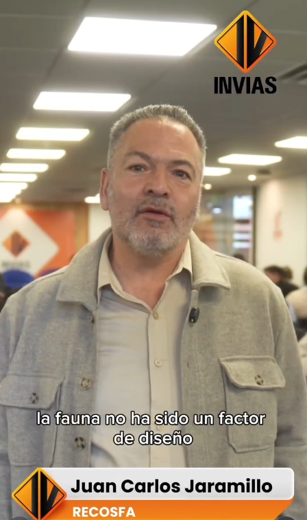
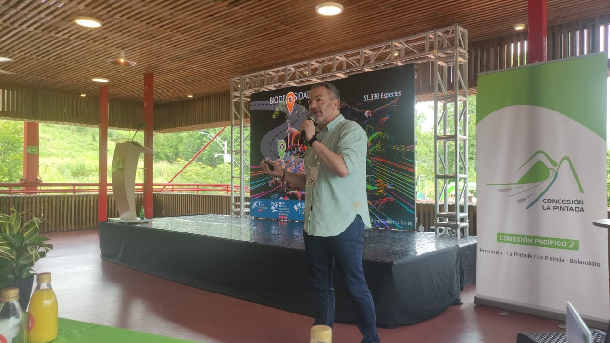
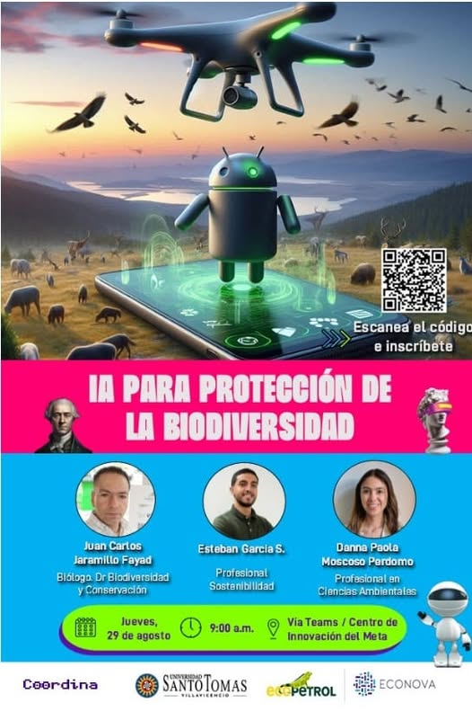
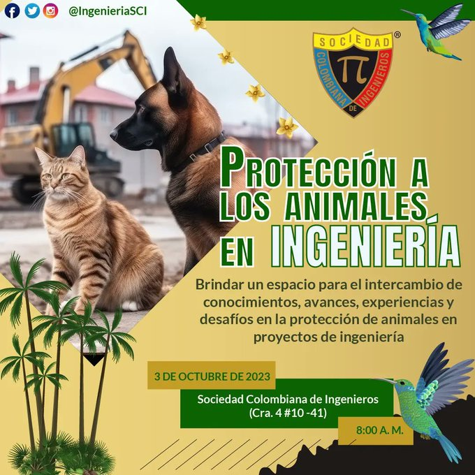
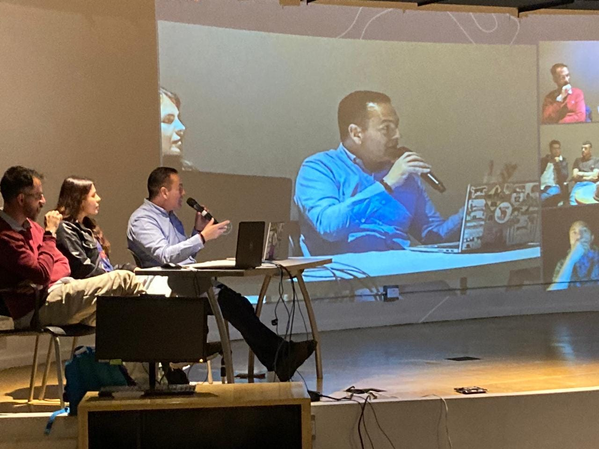

# 📅 Charlas y Eventos

---
2026
---

## Lanzamiento de la Estrategia Nacional para la Prevención de Siniestralidad Vial por Atropellamiento de Fauna

Fecha: 18/02/2026

Link:
https://www.youtube.com/live/M8GJQ6qR9Kg

## Lanzamiento de la Guía para la Identificación e Implementación de Medidas de Manejo frente al Atropellamiento de Fauna Silvestre

Fecha: 03/02/2026

Link:
https://www.instagram.com/reel/DUZXdhtjQ2U/?utm_source=ig_web_copy_link&igsh=MzRlODBiNWFlZA==

---
2025
---

## V SIMPOSIO COLOMBIANO DE ECOLOGÍA DE CARRETERAS Y EL II SIMPOSIO DE IMPACTO DE LAS INFRAESTRUCTURAS SOBRE LA FAUNA

Fecha: 31/08/2025

## Rutas Seguras para la Biodiversidad: estrategias en la Mitigación del Atropellamiento de Fauna Silvestre en Colombia

Fecha: 24/04/2025

---
2024
---

## Tercer foro de la Seguridad Vial

Fecha: 12/09/2024

## IA para la protección de biodiversidad

Fecha: 29/08/2024

## Punto pedagógico, sobre el tema de seguridad vial y atropellamiento de fauna silvestre

Fecha: 22/05/2024

Link:
https://www.facebook.com/share/v/1DoXtYXuju/

## El poder de salvar animales en las vías 

Fecha: 14/05/2024

Link:
https://www.facebook.com/share/p/1MNMAtYVAe/

---
2023
---

## ASOCIACIÓN ESPAÑOLA DE ECOLOGÍA TERRESTRE

Fecha: 17/10/2023

Descripción:
Participando en #AEET2023 en Almería -España, mostrando los trabajos realizados por 
@ITMinstitucion y @ConLaPintada en búsqueda de la conservación de la biodiversidad en este corredor vial.a seguir el congreso en twitter con @_AEET_

Link:
https://x.com/recosfa/status/1714282947048792575?s=20

## Ciencias de datos y conservación de la biodiversisdad en las vías

Fecha: 06/10/2023

Descripción:
Charla realizada en el ITM sede Robledo

## Protección de los animales en ingeniería

Fecha: 03/10/2023

Descripción:
Evento de la Sociedad Antioqueña de Ingenieros

## Atropellamiento de fauna silvestre: impactos de las vías, nuevas perspectivas y avances

Fecha: 25/08/2023

Descripción:
Charla realizada en compañia del Instituto Humboldt

## Coloquio de crisis climática y biodiversidad

Fecha: 26/05/2023

Descripción:
QUE TU VIDA NO TERMINE LA MÍA | Coloquio de crisis climática y Biodiversidad | Parque Explora

Link:
https://www.youtube.com/watch?v=PBLnk62w3BA

## Simposio de Impacto de las infraestructuras sobre la fauna silvestre, en el marco del VI Congreso Colombiano de Zoologia

Fecha: 29/03/2023

Descripción:
Simposio de Impacto de las infraestructuras sobre la fauna silvestre, en el marco del VI Congreso Colombiano de Zoologia. Un fabuloso espacio para compartir conocimientos y aprender con los excelentes trabajos presentados. 

Link:
https://www.youtube.com/watch?v=PBLnk62w3BA

---
2022
---

## Congreso Nacional de Conservación

Fecha: 05/06/2024

Descripción:
Evento enfocado en estrategias de conservación de fauna en Colombia.

Link:
tsrhs

---
2021
---

## Congreso Nacional de Conservación

Fecha: 05/06/2024

Descripción:
Evento enfocado en estrategias de conservación de fauna en Colombia.

Link:
tsrhs

---
2020
---

## Congreso Nacional de Conservación

Fecha: 05/06/2024

Descripción:
Evento enfocado en estrategias de conservación de fauna en Colombia.

Link:
tsrhs

---
2019
---

## Congreso Nacional de Conservación

Fecha: 05/06/2024

Descripción:
Evento enfocado en estrategias de conservación de fauna en Colombia.

Link:
tsrhs

---
2018
---

## Congreso Nacional de Conservación

Fecha: 05/06/2024

Descripción:
Evento enfocado en estrategias de conservación de fauna en Colombia.

Link:
tsrhs
