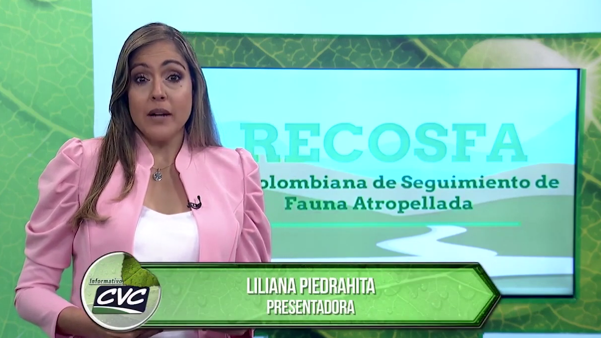
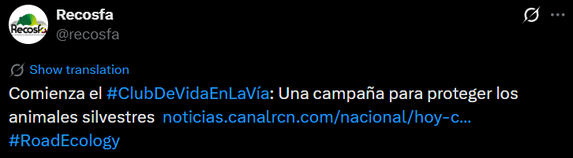
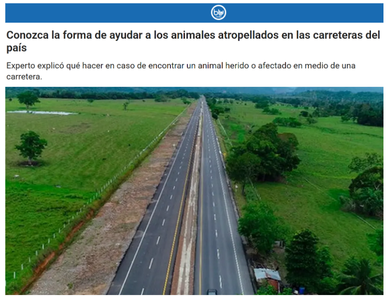
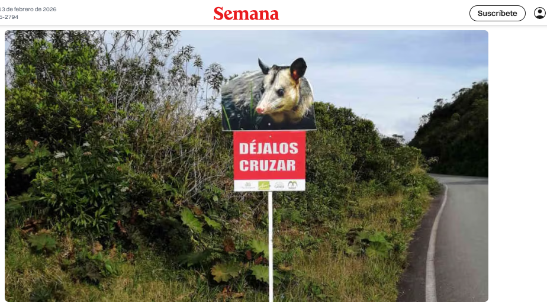
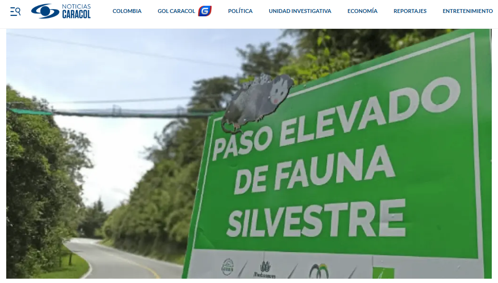
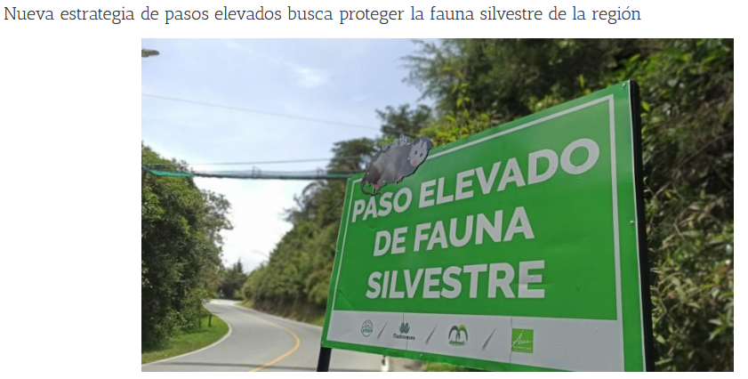
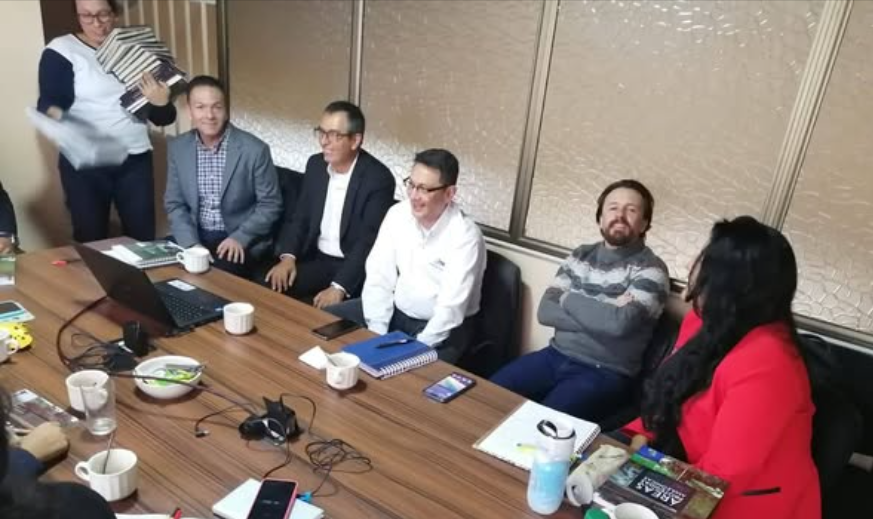
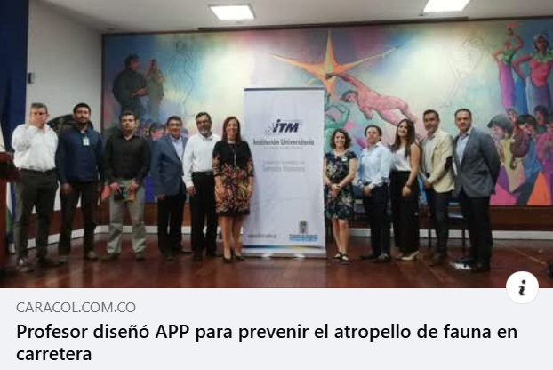

# 📰 Noticias

---

## 2024

### Nuevo Convenio con Parques Nacionales

Año: 2024

Link:
https://recosfa.org/convenio-2024

---

## 2023

### Rescate de fauna silvestre en Antioquia

Año: 2023

Link:
https://recosfa.org/rescate-2023

---

## 2023

### Rescate de fauna silvestre en Antioquia

Año: 2023

Link:
https://recosfa.org/rescate-2023

---

## 2022

### Rescate de fauna silvestre en Antioquia

Año: 2023

Link:
https://recosfa.org/rescate-2023

---

## 2021

### Rescate de fauna silvestre en Antioquia

Año: 2023

Link:
https://recosfa.org/rescate-2023

---

## 2020

### Hoy queremos informar con gran alegría, que oficialmente se lanzó el Grupo de Trabajo en Transportes para Latinoamérica y el Caribe (LAC TWG) @lactwg ,  en el marco de la Unión Internacional para la Conservación de la Naturaleza (IUCN/UICN) y el Grupo de Especialistas en Conservación de Conectividad de la Comisión Mundial de Áreas Protegidas (CMAP/WCPA).

Año: 2020

Link:
https://www.facebook.com/share/p/1DNhNqciJu/

### Recosfa, la aplicación móvil para reportar atropellamiento de fauna en las vías de Colombia

Año: 2020

Link:
https://www.facebook.com/share/v/1ApHZ6qRhH/

### APP PARA REPORTAR ATROPELLAMIENTO DE ANIMALES

Año: 2020

Link:
https://www.youtube.com/watch?v=THG5JFzauQk

### Comienza el #ClubDeVidaEnLaVía: Una campaña para proteger los animales silvestres

Año: 2020

Link:
https://twitter.com/recosfa/status/1271207314352214017?s=20

### CONOZCA LA FORMA DE AYUDAR A LOS ANIMALES ATROPELLADOS EN LAS CARRETERAS DEL PAÍS

Año: 2020

Link:
https://www.bluradio.com/sociedad/conozca-la-forma-de-ayudar-los-animales-atropellados-en-las-carreteras-del-pais-250918-ie430/?fbclid=IwAR0DDUM-bxzwtUy1tYlCXMoUUmjw34mTOsFZf-fycpB4VzEtpddNLDKZT40

### ¡Pare! Paso de fauna silvestre por la vía

Año: 2020

Link:
https://www.semana.com/medio-ambiente/articulo/pare-paso-de-fauna-silvestre-por-la-via/50597/?fbclid=IwAR3HQKZZHEkSylO8_7e3LGjh62LzCBFUrEEFy-rLYUQLMINkPtQvs7wJyio

### Instalan paso de fauna silvestre para salvar a las zarigüeyas en vía del oriente antioqueño

Año: 2020

Link:
https://noticias.caracoltv.com/antioquia/instalan-paso-de-fauna-silvestre-para-salvar-a-las-zarigueyas-en-via-del-oriente-antioqueno

### NUEVA ESTRATEGIA DE PASOS ELEVADOS BUSCA PROTEGER LA FAUNA SILVESTRE DE LA REGIÓN

Año: 2020

Link:
https://www.cornare.gov.co/noticias-corporativas/nueva-estrategia-de-pasos-elevados-busca-proteger-la-fauna-silvestre-de-la-region/?fbclid=IwAR2KCdzKsCh1yxdY1rrmGXPzN4qrSC0YaipoxKG0bM9Xl2wcsVdO8H965V8

### El ITM a través del PECIV y Recosfa asistimos a una reunión convocada por el Ministerio de Ambiente y Desarrollo Sostenible para crear un grupo de trabajo alrededor de la implementación de pasos de fauna en el país.

Año: 2020

Link:
https://www.facebook.com/recosfa/posts/2616179031812767/

### APP PARA PREVENIR EL ATROPELLO DE FAUNA EN CARRETEARA

Año: 2020

Link:
https://twitter.com/recosfa/status/1222704331377512450?s=20

---

## 2019

### El @ITM_Medellin lanzó el Programa de Ecología de las Carreteras e Infraestructura Verde - @PECIVITM

Año: 2019

Link:
https://twitter.com/pecivitm

### Recosfa, aplicación para proteger las especies vulnerables en carretera

Año: 2019

Link:
https://www.youtube.com/watch?v=jgrAAxwGOKA

### Estuvimos en el programa #PlanetaCaracol de Caracol Radio hablando sobre ecología de carreteras y atropellamiento de fauna, y sobre el trabajo que junto al ITM Instituto Tecnológico Metropolitano estamos realizando para estudiar y comprender esta compleja problemática.¡Escúchalo completo aquí!

Año: 2019

Link:
https://www.facebook.com/share/v/1DTNZqcdxb/

### El @ITM_Medellin, #RECOSFA y el #PECIV se unen a la Escuela de Ecología Urbana de #Medellín y hacen parte del Consejo Rector de esta iniciativa @Areametropol @EAFIT @UdeA

Año: 2019

Link:
https://twitter.com/juangui_perez/status/1195497640693252096?s=20

