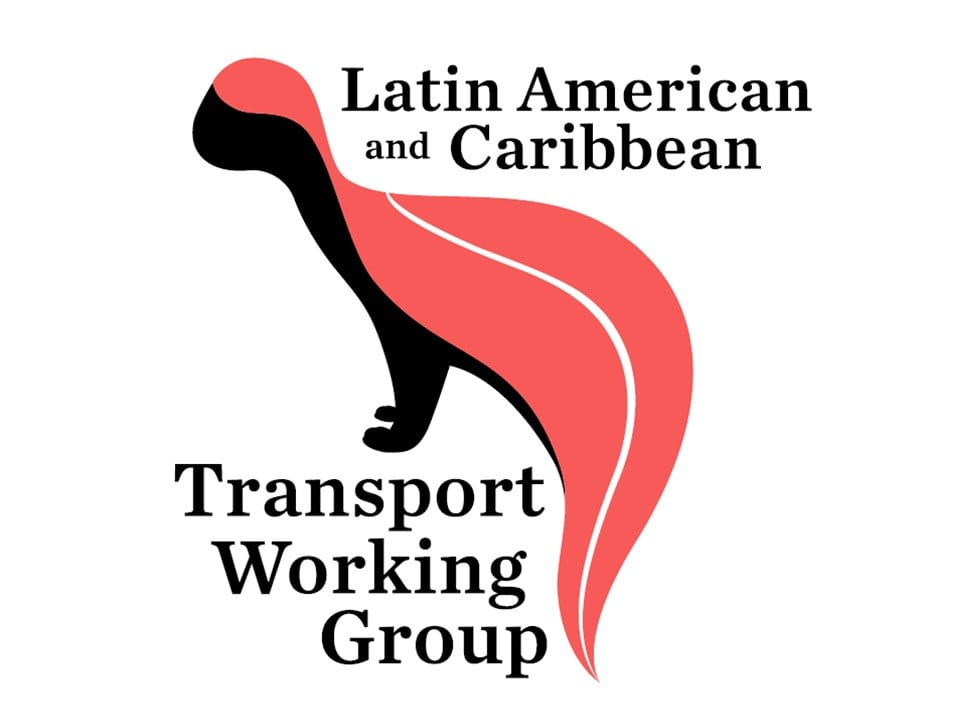

# 📰 Noticias

---

## 2024

### Nuevo Convenio con Parques Nacionales

Año: 2024

Link:
https://recosfa.org/convenio-2024

---

## 2023

### Rescate de fauna silvestre en Antioquia

Año: 2023

Link:
https://recosfa.org/rescate-2023

---

## 2023

### Rescate de fauna silvestre en Antioquia

Año: 2023

Link:
https://recosfa.org/rescate-2023

---

## 2022

### Rescate de fauna silvestre en Antioquia

Año: 2023

Link:
https://recosfa.org/rescate-2023

---

## 2021

### Rescate de fauna silvestre en Antioquia

Año: 2023

Link:
https://recosfa.org/rescate-2023

---

## 2020

### Rescate de fauna silvestre en Antioquia

Año: 2023

Link:
https://recosfa.org/rescate-2023

---

## 2019

### El @ITM_Medellin lanzó el Programa de Ecología de las Carreteras e Infraestructura Verde - @PECIVITM
Año: 2019

Link:
https://twitter.com/pecivitm

