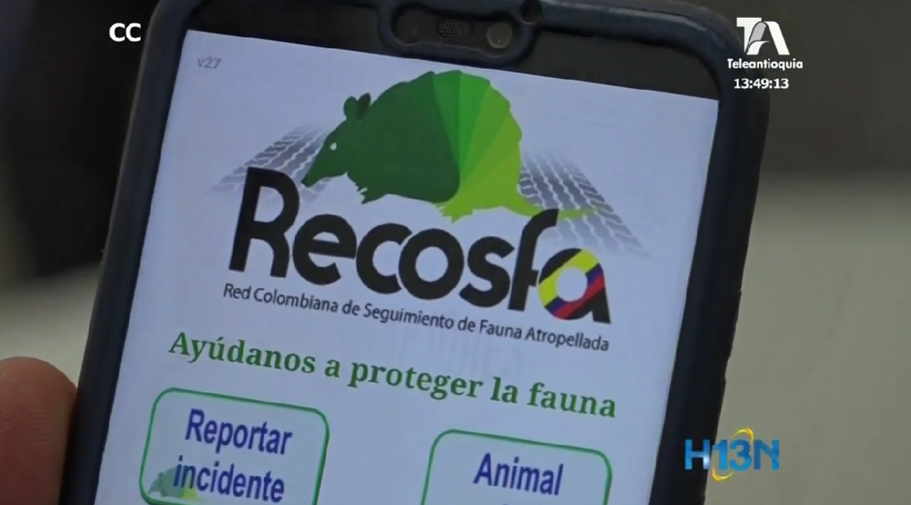
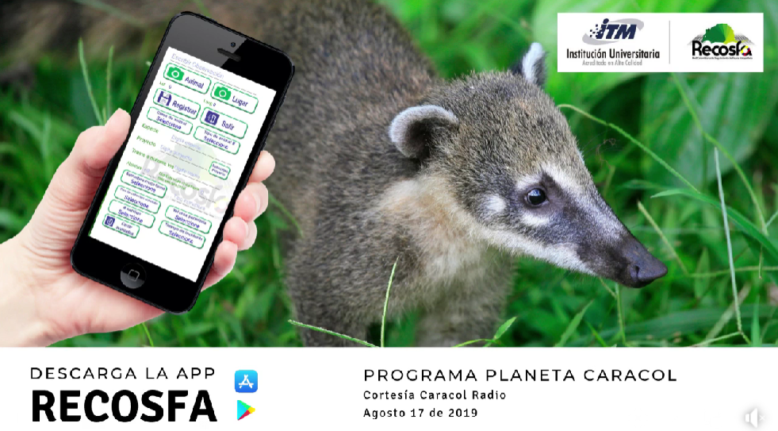
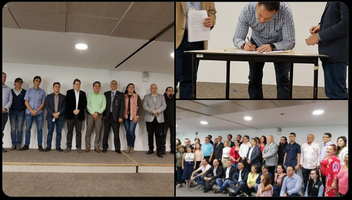

# 📰 Noticias

---

## 2024

### Nuevo Convenio con Parques Nacionales

Año: 2024

Link:
https://recosfa.org/convenio-2024

---

## 2023

### Rescate de fauna silvestre en Antioquia

Año: 2023

Link:
https://recosfa.org/rescate-2023

---

## 2023

### Rescate de fauna silvestre en Antioquia

Año: 2023

Link:
https://recosfa.org/rescate-2023

---

## 2022

### Rescate de fauna silvestre en Antioquia

Año: 2023

Link:
https://recosfa.org/rescate-2023

---

## 2021

### Rescate de fauna silvestre en Antioquia

Año: 2023

Link:
https://recosfa.org/rescate-2023

---

## 2020

### Rescate de fauna silvestre en Antioquia

Año: 2023

Link:
https://recosfa.org/rescate-2023

---

## 2019

### El @ITM_Medellin lanzó el Programa de Ecología de las Carreteras e Infraestructura Verde - @PECIVITM

Año: 2019

Link:
https://twitter.com/pecivitm

### Recosfa, aplicación para proteger las especies vulnerables en carretera

Año: 2019

Link:
https://www.youtube.com/watch?v=jgrAAxwGOKA

### Estuvimos en el programa #PlanetaCaracol de Caracol Radio hablando sobre ecología de carreteras y atropellamiento de fauna, y sobre el trabajo que junto al ITM Instituto Tecnológico Metropolitano estamos realizando para estudiar y comprender esta compleja problemática.¡Escúchalo completo aquí!

Año: 2019

Link:
https://www.facebook.com/share/v/1DTNZqcdxb/

### El @ITM_Medellin, #RECOSFA y el #PECIV se unen a la Escuela de Ecología Urbana de #Medellín y hacen parte del Consejo Rector de esta iniciativa @Areametropol @EAFIT @UdeA

Año: 2019

Link:
https://twitter.com/juangui_perez/status/1195497640693252096?s=20

