# 🎥 Videos

---

## 2025

---

## Sesión del Concejo de Medellín sobre protección de la fauna silvestre

Fecha: 04/08/2025

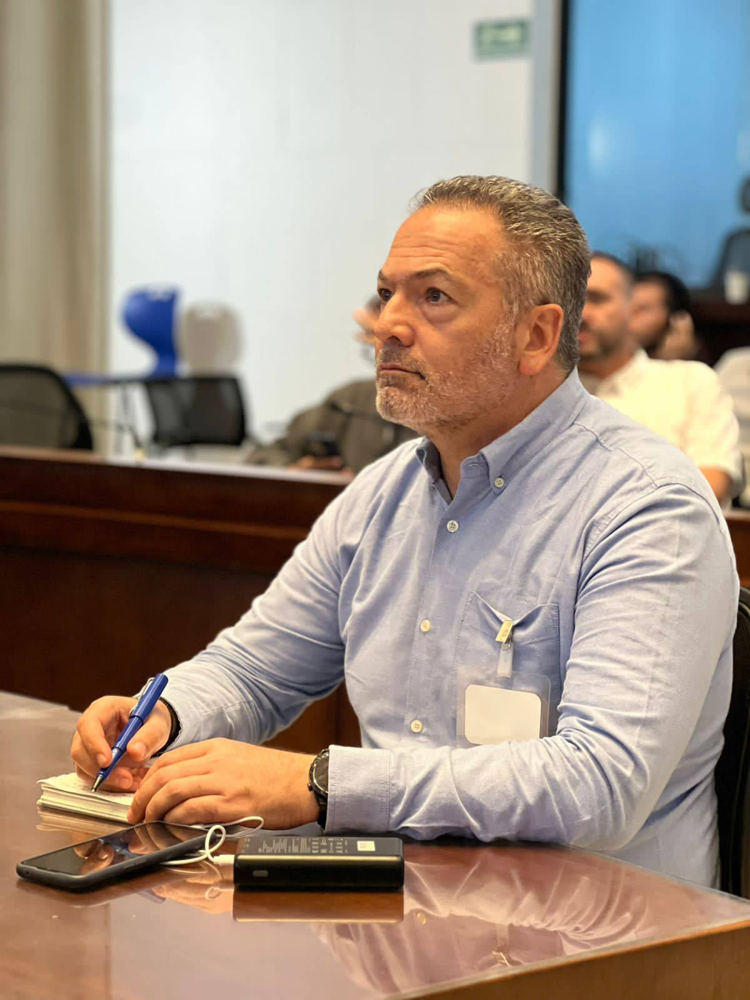

Link:
https://www.youtube.com/watch?v=_XDaFSkXywg

---

## 2024

---

## Prevención de atropellamiento de fauna silvestre en las vías

Fecha: 23/09/2024

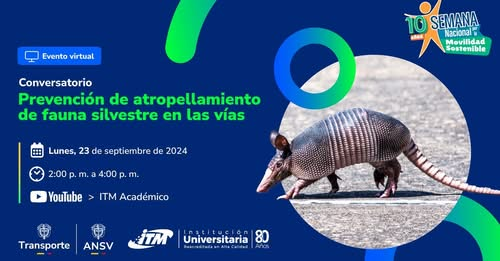

Link:
https://www.youtube.com/live/1J2vCrjlCqs

## Radio Candela

Fecha: 28/03/2024

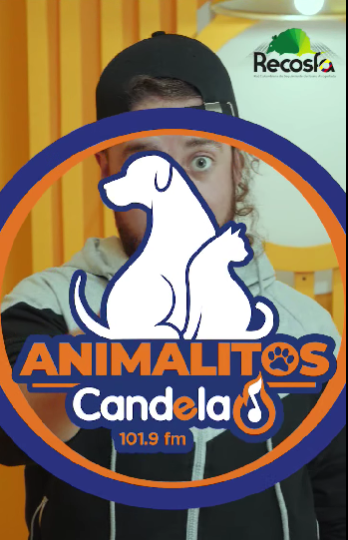

Link:
https://www.facebook.com/share/v/18B4vMiQnq/

---

## 2023

---

## El Trabajo del ITM con la Concesión La Pintada para una vía más sostenible

Fecha: 08/05/2023

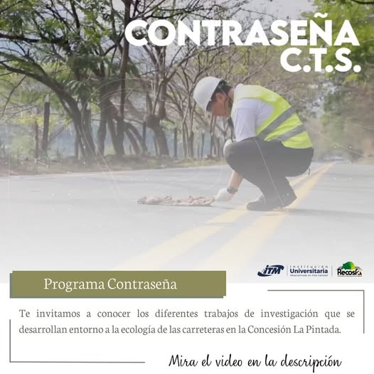

Link:
https://www.youtube.com/watch?v=ZP0zsTmJXaM

---

## 2020

---

## RECOSFA - CUENTOS VERDES

Fecha: 09/07/2020

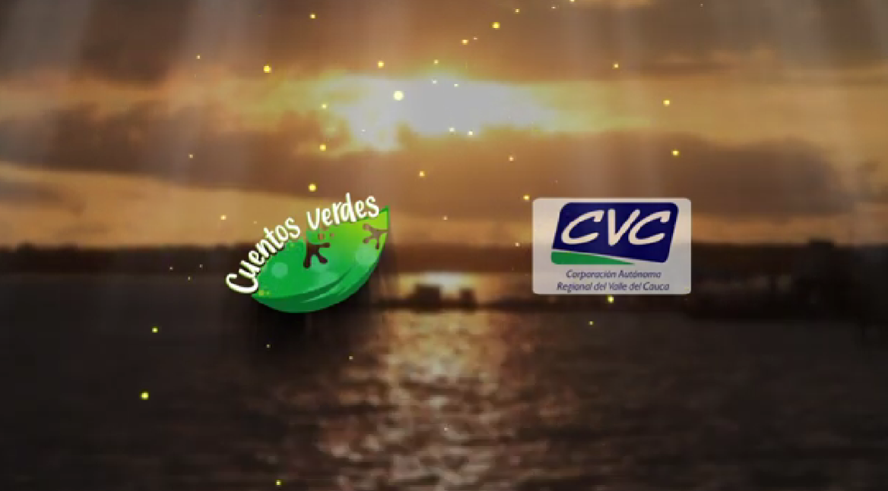

Link:
https://www.youtube.com/watch?v=r0aQrzsiCgI

---

## 2019

---

## INVITACIÓN CIVIB Y EIDS

Fecha: 04/09/2019

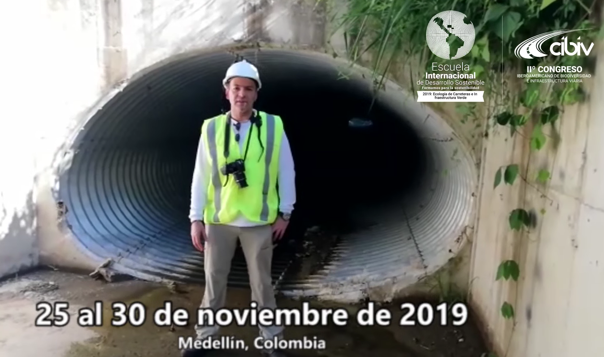

Link:
https://www.facebook.com/recosfa/videos/en-noviembre-tendremos-en-el-itm-instituto-tecnol%C3%B3gico-metropolitano-de-medell%C3%ADn/1120738158118430/

## ATROPELLAMIENTO DE FAUNA, UNA AMENAZA PARA LA CONSERVACIÓN DE LA BIODIVERSIDAD (ROADECOLOGY)

Fecha: 08/09/2019

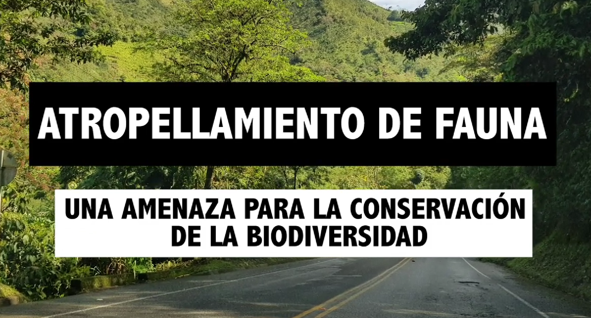

Link:
https://www.youtube.com/watch?v=bu4_v7liHnc&t=15s

## JORNADA PEDAGÓGICA CONTRA EL TRÁFICO DE FAUNA SILVESTRE EN ANTIOQUIA

Fecha: 12/09/2019

Link:
https://twitter.com/recosfa/status/1172149160683941888?s=20

## USA LA APP RECOSFA

Fecha: 16/09/2019

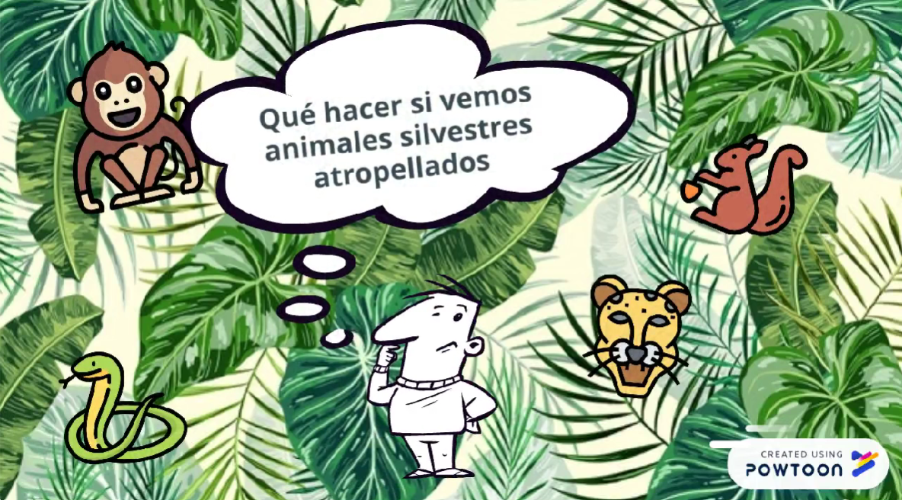

Link:
https://www.youtube.com/watch?v=ugck8hpP_SA

## CONTRASEÑA: PASOS DE FAUNA

Fecha: 13/08/2019

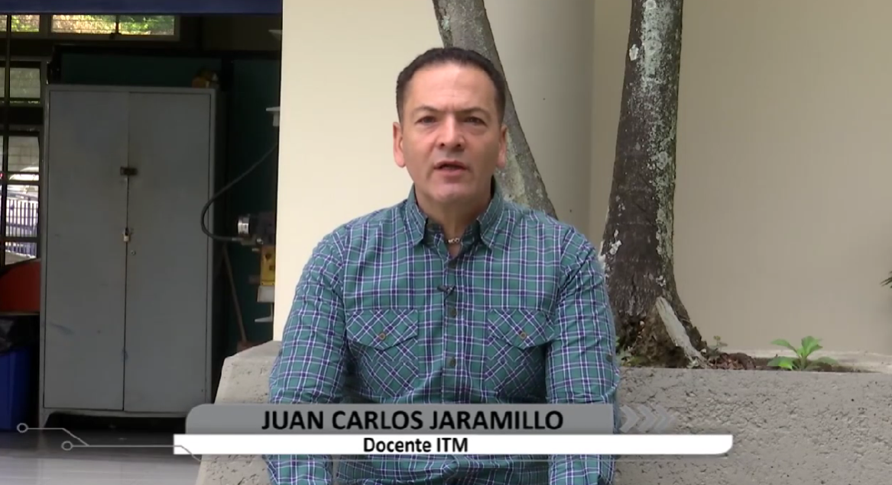

Link:
https://www.youtube.com/watch?v=DHm2wjE6nS4

## II CONGRESO IBEROAMERICANO DE BIODIVERSIDAD E INFRAESTRUCTURA VIARIA

Fecha: 28/07/2019

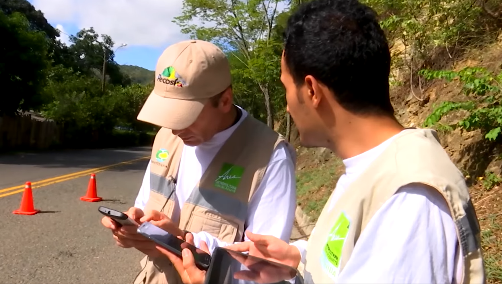

Link:
https://www.facebook.com/recosfa/videos/ii-congreso-iberoamericano-de-biodiversidad-e-infraestructura-viaria/337697930474075/

## ACTA 618 CONCEJO DE MEDELLÍN

Fecha: 27/03/2019

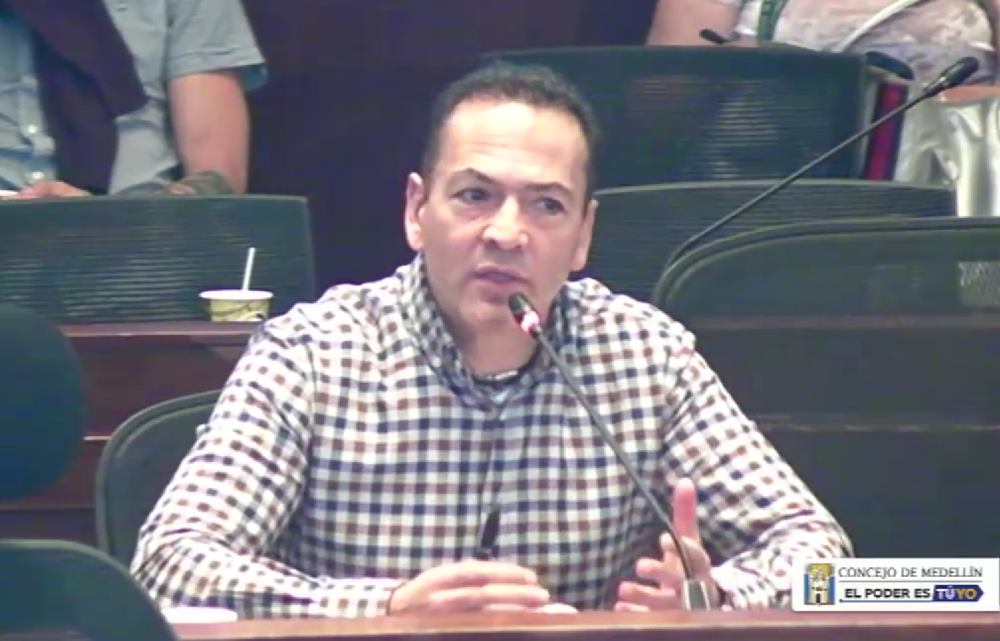

Link:
https://www.youtube.com/watch?v=sv3p1WkuxX4&t=4200s

---

## 2017

---

## APP RECOSFA, REPORTA ANIMALES ATROPELLADOS EN LAS VIAS 

Fecha: 06/11/2017

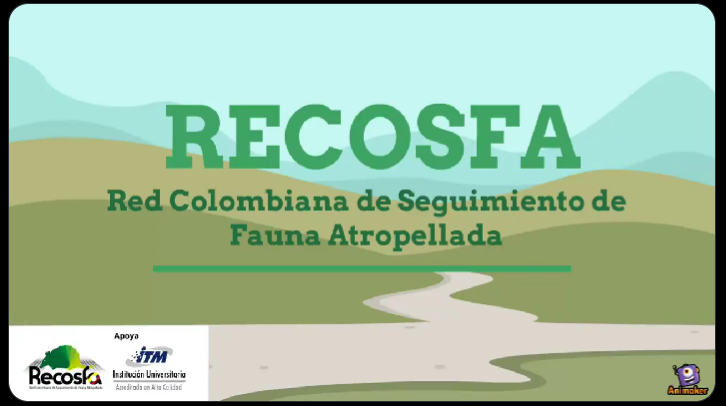

Link:
https://x.com/recosfa/status/905121048001216513?s=20

## Contraseña: Convenio Atropellamiento de Fauna

Fecha: 05/09/2017

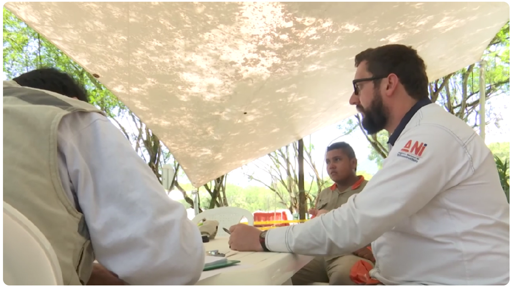

Link:
https://www.youtube.com/watch?v=FT7VsX3phbI

---

## 2016

---

## Contraseña: Atropellamiento de Fauna

Fecha: 06/06/2016

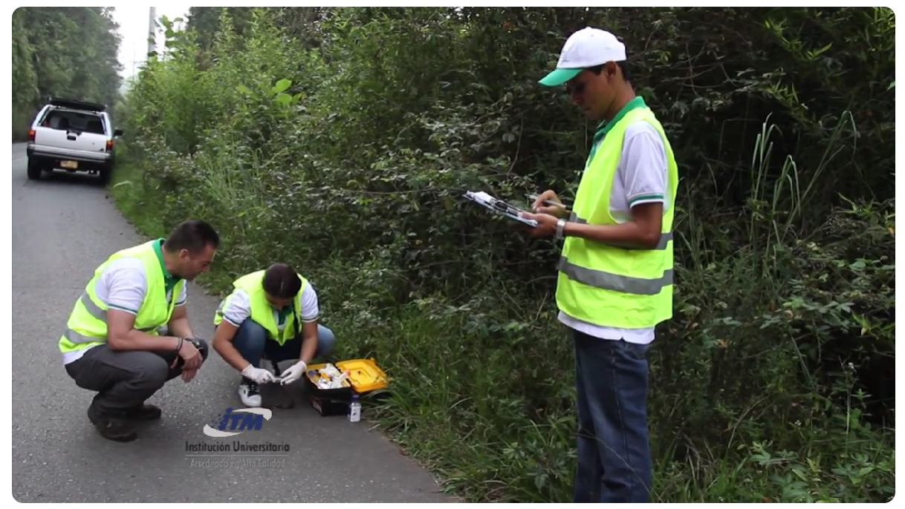

Link:
https://www.youtube.com/watch?v=So2z6v4pIxY
